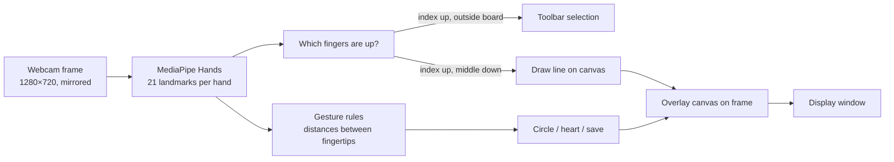

# Hand Gesture Drawing App

Draw in the air with your finger. A webcam feed is processed with **MediaPipe Hands** to track 21 hand landmarks in real time, and your index finger becomes a brush on a virtual whiteboard. Hand shapes trigger actions: an "O" draws a circle, a heart draws a heart, and an OK sign saves the drawing.

## Features

- **Finger painting:** raise only your index finger over the whiteboard to draw
- **Touch-free toolbar:** hover your index finger over on-screen buttons to pick a colour (5 colours plus an eraser), change brush size, clear the canvas, or show/hide the whiteboard and menus
- **Gesture shortcuts** (2-second cooldown):

  | Gesture | Action |
  | --- | --- |
  | "O" shape (fingertips together, thumb touching) | Draws a circle at your index finger |
  | One-hand heart | Draws a heart |
  | Two-hand heart | Draws a heart between both hands |
  | OK sign | Saves the canvas to `saved_drawing.jpg` |

- Keyboard: `q` quits

## How it works



Gestures are recognised with geometric rules on landmark positions (for example, the OK sign is the thumb tip within 30 px of the index tip while the other three fingers are raised), not with a trained classifier.

## Tech stack

Python · OpenCV · MediaPipe · NumPy

## Project structure

| File | Purpose |
| --- | --- |
| `main.py` | **The gesture drawing app** (entry point) |
| `handTracker.py` | Wrapper around MediaPipe Hands: landmarks, positions, raised fingers |
| `icons/` | Toolbar icons |
| `paintapp.py`, `paintapp_final.py`, `FinalPaint.py`, `autofix.py` | Earlier mouse-based paint app experiments built with PyQt5 (shapes, fill, eraser, save) |
| `style_transfer.py` | Separate experiment: neural style transfer GUI with PyTorch (VGG features) |

## Setup

Requires Python 3.9–3.12 (MediaPipe does not support every new Python release) and a webcam.

```bash
python -m venv .venv
.venv\Scripts\activate          # macOS/Linux: source .venv/bin/activate
pip install -r requirements.txt
python main.py
```

Run it from the repository folder so the `icons/` paths resolve.

## Demo

_To add:_ a GIF of drawing with a finger and triggering the heart and OK gestures.

## Limitations

- Gesture thresholds are in pixels and tuned for a 1280×720 frame and a typical distance from the camera.
- Saving overwrites `saved_drawing.jpg` each time.
- `keras_model.h5`, `labels.txt` and `hand_joints.csv` are not used by any script in the repository.

## Future improvements

- Train a small classifier on recorded landmarks to replace hand-tuned thresholds
- Save drawings with timestamps instead of overwriting
- Add undo

## Author

**Hsu Myat Noe** · [GitHub](https://github.com/NoeNoe25) · [LinkedIn](https://www.linkedin.com/in/hsu-myat-noe569aa729a/)
